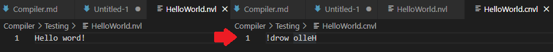
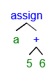
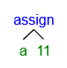

I have a surface level understanding of how compilers work. For my own scripting language I will have to make make my own in order to turn a script into instructions.

I will be following: https://compilers.iecc.com/crenshaw/

I begin with a basic program that can read a file, apply a transformation and write the output by reading arguments from a command line.

Now that I can emit output to a file I can start with the process of translating input to a set of instructions as output, these instructions will be a set of codes that my runtime consumes to change the current state.

For now I have defined a set of instructions used for basic math operations. In order to generate those instructions I will have to strucure the code in the script to make it easy for my compiler to place the instructions sequentially. To do this, I make use of Abstract syntax tree. An abstract syntax tree is a tree with nodes containing the relevant tokens for instructions, like variables and instruction codes. By traversing the tree it is possible correctly formulate the instructions in the right order.

As example, the statement `a = 5 + 6` would be transformed into:

This would create an add operation to add `5` and `6` together, after the result has been calculated it would store the result in variable `a`.

Smart compilers can analyze a syntax tree to come up with techniques to reduce the size of the generated code, like constant folding, a process in which the compiler checks if an equation can be skipped by computing the result and replacing the node with the result. Using the tree above it would look like:

Now that the tree has been simplified, it allows the compiler to emit just the storing of `11` into the `a` variable.

For now I won't be using any tricks to generate optimized code, due to the early stage of development.